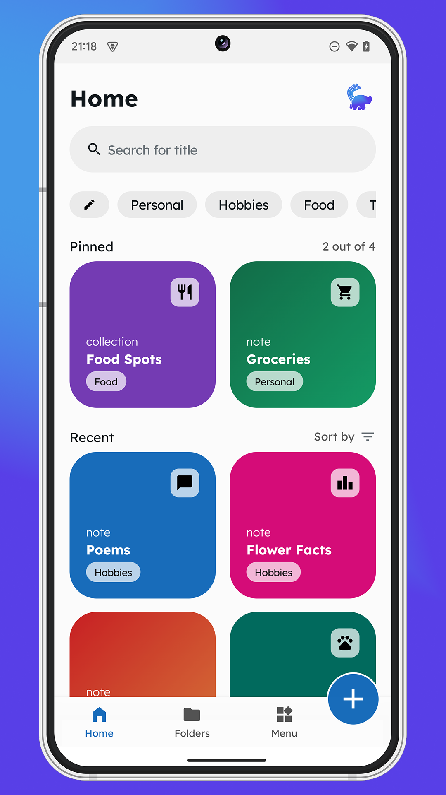
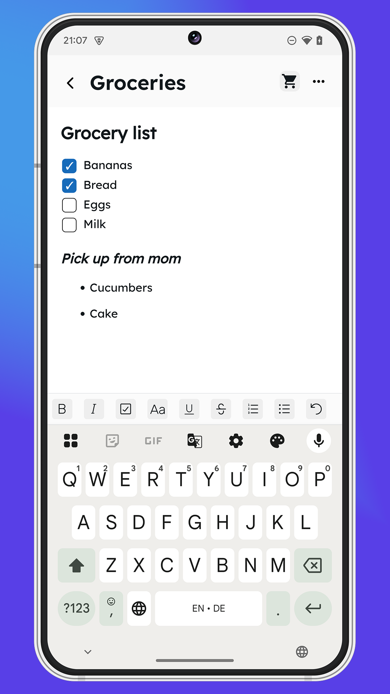
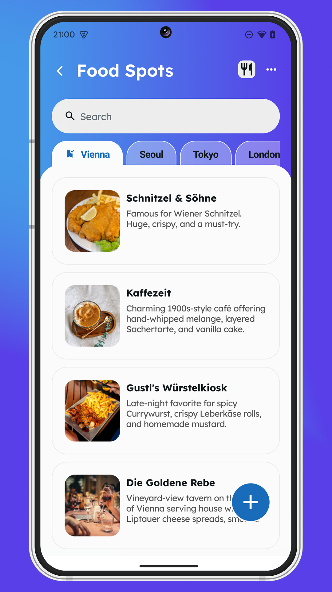
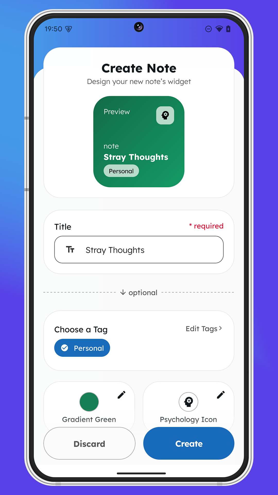
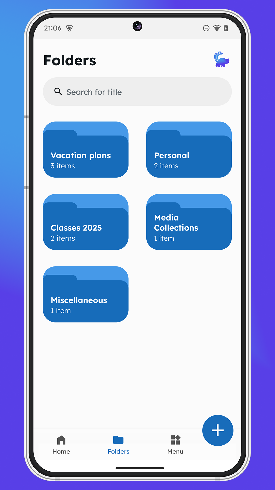
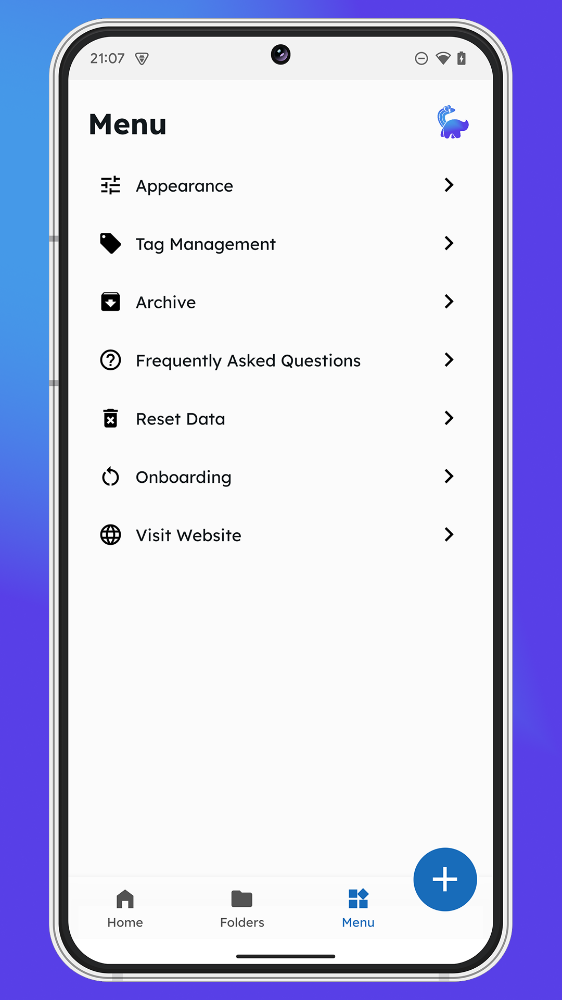
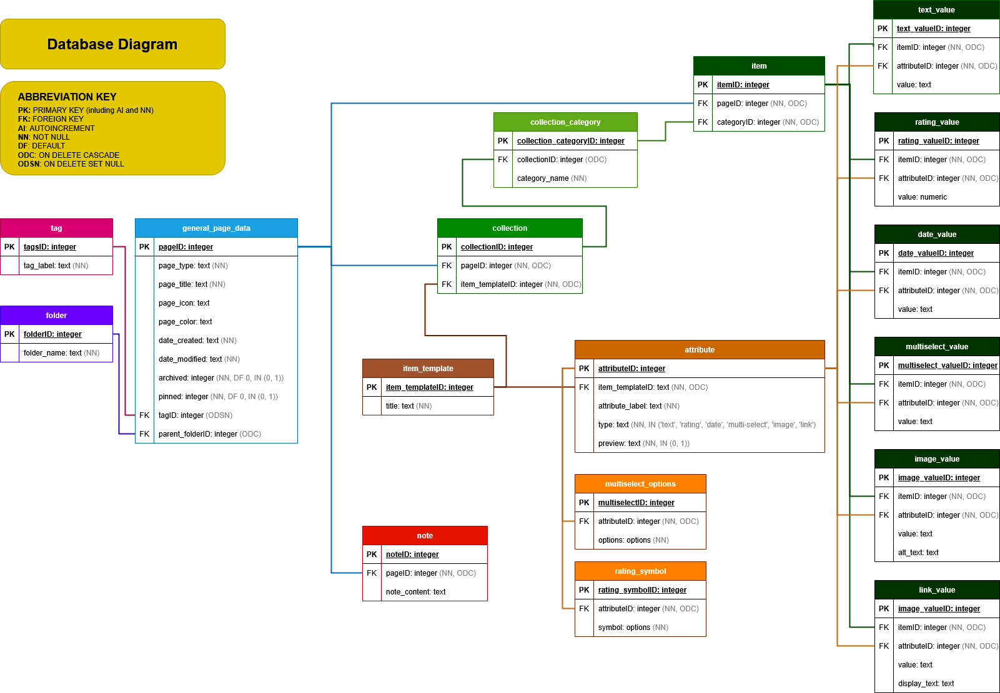

# Krizzle


> TL;DR: **Krizzle** is a fully offline, customizable note-taking app built with Expo and SQLite. It supports rich-text notes, structured collections with templates, folders, tags, and more. Designed for personal organization and efficiency, it’s available on the [Google Play Store](https://play.google.com/store/apps/details?id=com.krizzle) (status June 14th 2025).

---

Table of Contents

- [Project Overview](#project-overview)
- [Features](#features)
- [App Screenshots](#app-screenshots)
- [Technology Stack](#technology-stack)
- [Architecture Overview](#architecture-overview)
- [Development & Testing](#development-and-testing)
- [App Behavior & Permissions](#app-behavior-and-permissions)
- [Deployment](#deployment)
- [Privacy & Security](#privacy-and-security)
- [Licensing & Contributions](#licensing-and-contributions)
- [FAQ](#faq)
- [Final Notes & Contributors](#final-notes-and-contributors)

## Project Overview

Krizzle is a personal note-taking app built with a focus on full offline capability and flexible data organization. The app enables users to write rich text notes, organize content into collections using customizable templates, and sort their work using tags and folders. Templates can contain up to 10 fields including text, image, link, multiselect, date, and rating. The app includes theme selection between light and dark mode, an archive system for hiding notes and collections, and a built-in FAQ. All data stays entirely on the user’s device. Further information can be found at [our website](https://krizzle-website.vercel.app/privacy).

## Features

Krizzle includes the following key features:

- **Note Editor:** a rich-text editor for expressive note writing.
- **Collections:** customizable collections that use templates with support for multiple field types.
- **Organization tools:** such as folders, tags, and archiving.
- **Theme selection:** light and dark themes with persistent user preference.
- **FAQ and Onboarding:** for answering common questions.
- **Offline-first design:** no dependency on the internet.

## App Screenshots

<table style="width: 100%; table-layout: fixed; border: 0px; text-align: center;">
   <tr>
      <td>Home</td>
      <td>Note</td>
      <td>Collection</td>
   </tr>
   <tr>
      <td></td>
      <td></td>
      <td></td>
   </tr>
   <tr height="20px"></tr>
   <tr>
      <td>Widget Creation</td>
      <td>Folders</td>
      <td>Menu</td>
   </tr>
   <tr>
      <td></td>
      <td></td>
      <td></td>
  </tr>
</table>

### Example Use Cases

Users can create custom collections such as:

#### 1. **Book Library**

An example of a template for a `book`:

<table style="table-layout: fixed; text-align: center;">
   <tr>
      <td><b>Field Label</b></td>
      <td>Title</td>
      <td>Author</td>
      <td>Description</td>
      <td>Rating</td>
      <td>Cover</td>
   </tr>
   <tr>
      <td><b>Field Type</b></td>
      <td><i>text</i></td>
      <td><i>text</i></td>
      <td><i>text</i></td>
      <td><i>rating (book icon)</i></td>
      <td><i>image</i></td>
   </tr>
</table>

#### 2. **Café Record**

An example of a template for a `cafe`:

<table style="table-layout: fixed; text-align: center;">
   <tr>
      <td><b>Field Label</b></td>
      <td>Name</td>
      <td>Menu</td>
      <td>Pastry Rating</td>
      <td>Drink Rating</td>
      <td>Latest Visit</td>
      <td>Offers</td>
   </tr>
   <tr>
      <td><b>Field Type</b></td>
      <td><i>text</i></td>
      <td><i>text</i> or <i>image</i></td>
      <td><i>rating (croissant icon)</i></td>
      <td><i>rating (mug icon)</i></td>
      <td><i>date</i></td>
      <td><i>multiselect</i> (e.g. <i>'croissants'</i> & <i>'sandwiches'</i>)</td>
   </tr>
</table>

#### 3. **Dream Journal**

An example of a template for a `dream`:

<table style="table-layout: fixed; text-align: center;">
   <tr>
      <td><b>Field Label</b></td>
      <td>Focal Point</td>
      <td>Details</td>
      <td>Mood Rating</td>
      <td>Date</td>
   </tr>
   <tr>
      <td><b>Field Type</b></td>
      <td><i>text</i></td>
      <td><i>text</i></td>
      <td><i>rating</i></td>
      <td><i>date</i></td>
   </tr>
</table>

#### 4. **Travel Record and Planner**

An example of a template for a `travel spot`:

<table style="table-layout: fixed; text-align: center;">
   <tr>
      <td><b>Field Label</b></td>
      <td>Place</td>
      <td>Location</td>
      <td>Start Date</td>
      <td>End Date</td>
      <td>Favourite Memory</td>
      <td>Status</td>
   </tr>
   <tr>
      <td><b>Field Type</b></td>
      <td><i>text</i></td>
      <td><i>text</i></td>
      <td><i>date</i></td>
      <td><i>date</i></td>
      <td><i>image</i></td>
      <td><i>multiselect</i> (<i>'planning'</i> & <i>'have visited'</i>)</td>
   </tr>
</table>

#### **Useful Website Record**

An example of a template for a `website`:

<table style="table-layout: fixed; text-align: center;">
   <tr>
      <td><b>Field Label</b></td>
      <td>Website Name</td>
      <td>Link</td>
      <td>Purpose</td>
   </tr>
   <tr>
      <td><b>Field Type</b></td>
      <td><i>text</i></td>
      <td><i>link</i></td>
      <td><i>text</i></td>
   </tr>
</table>

## Technology Stack

### Core Technologies

The application is built using:

- **Expo SDK 52**
- **React Native with TypeScript**

### Data Management

For data handling and persistence, the application uses:

- **SQLite via `expo-sqlite`**
- **AsyncStorage** for smaller settings

### Data Validation

- **Zod** for schema validation

## Architecture Overview

The repo is organized into distinct sections, each serving specific functions:

- `app/`: Contains UI screens, categorized by navigation tabs and other user-accessible screens.
- `components/`: Includes UI components such as modals, text editor files, and general-purpose UI elements.
- `assets/`: Stores static files like databases, fonts, images, and SVGs.
- `context/`: Provides contexts for repositories, services, and theme management.
- `hooks/`: Contains various hooks used throughout the application.
- `backend/`: Manages domain logic, database interactions, and business logic:
  - `domain/`: Defines entity schemas and common types using Zod.
  - `migrations/`: Handles database schema migrations (through RepositoryContext).
  - `repository/`: Handles database access logic.
  - `service/`: Implements business logic and communication of the frontend with repositories.
  - `util/`: Contains mapper classes and error definitions.
- `shared/`: DTOs, enums, and error handling types used in both backend and UI views.

## Development and Testing

### Requirements

- Node.js v20.18.0
- Latest Expo CLI (local version, not legacy)
- Expo Go with SDK 52 for Android. iOS support is limited due to `Expo Go` incompatability.

### Getting Started

To run the app locally for the first time:

```bash
npm install
npx expo start
```

You can then scan the QR code with Expo Go to preview the app.

If connectivity issues arise, starting with `--tunnel` could resolve them.

```bash
npx expo start --tunnel
```

If caching issues arise use `--clear` when starting.

```bash
npx expo start --clear
```

### Testing

Unit tests are written using Jest and located in `__tests__` directories. To run the tests, use:

```bash
npm test
```

### Linting and Formatting

`Prettier ESLint` (VSCode plugin) is used for consistent code formatting.

## App Behavior and Permissions

### Supported Platforms

Krizzle is fully supported on Android. For development the `Expo Go` version for SDK52 is needed.

Development for iOS is possible (and partially implemented), however if not already available, the download of the `Expo Go` version for SDK52 is not possible anymore. In this case a manual migration of the project to SDK53 would be necessary.

### Permissions

The app requests camera access for image input fields in collection items. This is handled using `expo-camera` and will not affect core functionality if denied.

### SQLite Database & Migrations

The app launches with a clean SQLite database stored in `assets/database`. All data remains local to the user’s device. To view and make changes to the database you can use the desktop application `DB Browser (SQLite)`. Below is the database diagram (status June 14th 2025).

The application has access to the database via `SQLiteProvider` (setup in `./app/_layout.tsx`). and communicate with it via the instantiated repositories inside the `RepositoryContext` component by using the hook `useRepositories()`.



Schema migrations are managed in `backend/migrations` and are automatically applied on app launch via `RepositoryContext`. The current schema version is stored using AsyncStorage, and each new migration must be manually registered by adding one to the current `SCHEMA_VERSION`. To implement a new migration, you can follow this structure:

```ts
// change 1 to the new SCHEMA_VERSION
1: async (db) => {
   // disable FKs temporarily
   await db.withExclusiveTransactionAsync(async (txn) => {
      try {
        await txn.execAsync(`
          PRAGMA foreign_keys = OFF;
        `);
      } catch (error) {
        console.log(error);
        throw error;
      }
   });
   // MIGRATION LOGIC - Example
   await db.withExclusiveTransactionAsync(async (txn) => {
      try {
        // check if table 'example' exists - create new one if not/migrate if it does
        const exampleCheck = await txn.getFirstAsync<{ name: string }>(
          `SELECT name FROM sqlite_master WHERE type='table' AND name='example';`,
        );
        if (exampleCheck) {
          await txn.execAsync(`
            ALTER TABLE example RENAME TO old_example;

            CREATE TABLE "example" (
              "exampleID"	INTEGER NOT NULL,
              "example_text"	TEXT,
              PRIMARY KEY("exampleID" AUTOINCREMENT),
            );

            INSERT INTO exmaple (exampleID, example_text)
            SELECT exampleID, example_text FROM old_exmpale;

            DROP TABLE IF EXISTS old_example;
          `);
        }
      } catch (error) {
        console.log(error);
        throw error;
      }
    });

   // reenable FKs
   await db.withExclusiveTransactionAsync(async (txn) => {
      try {
        await txn.execAsync(`
          PRAGMA foreign_keys = ON;
        `);
      } catch (error) {
        console.log(error);
        throw error;
      }
   });
},
```

## Deployment

### Distribution

Krizzle is publicly available on the [Google Play Store](https://play.google.com/store/apps/details?id=com.krizzle) (status 14. June 2025).

### Release Builds

Builds are created using the standard Expo build pipeline (either EAS or classic). OTA updates are currently not used, but support is in place via the `expo-updates` dependency.

## Privacy and Security

Krizzle is designed for privacy:

- No analytics, crash tracking, or remote API calls
- All data remains on-device and is never transmitted
- No user accounts, logins, or cloud sync
- No encryption is currently used for local data

The app is compliant with GDPR regulations. A public privacy policy is available at [our website](https://krizzle-website.vercel.app/privacy).

## Licensing and Contributions

This project is not accepting public pull requests. You may fork the repository for personal or educational use only. Commercial redistribution is not permitted. The _University of Applied Sciences St. Pölten_ is granted rights for academic and marketing use.

## FAQ

**Is the app usable without internet?**\
Yes. All features work offline. No internet is required or used.

**Does it work on iOS?**\
The project is partially developed for iOS. However, further development is only possible with manual migration of the project to SDK53, as the development and build version us SDK52, which is not supported in newer App Store versions of `Expo Go` (status June 14th 2025).

**Can I fork and modify the app?**\
Yes, for non-commercial use. Pull requests to the main project are not accepted.

**When was the app released?**\
Krizzle was published on the Google Play Store on June 4th, 2025.

## Final Notes and Contributors

Krizzle was built as an academic project in the final semester of the study program _Creative Computing_ at the _University of Applied Sciences St. Pölten_ with the goal of creating a mobile application. The team in accordance with their supervisor decided on the topic.

Members of the development team included:

- Maxima Eder
- Marco Huber
- Michaela Topalovic
- Noelle Jamöck
- Szabolcs Meszaros
- Seonghyeon Kim
- Stefanie Plankensteiner
